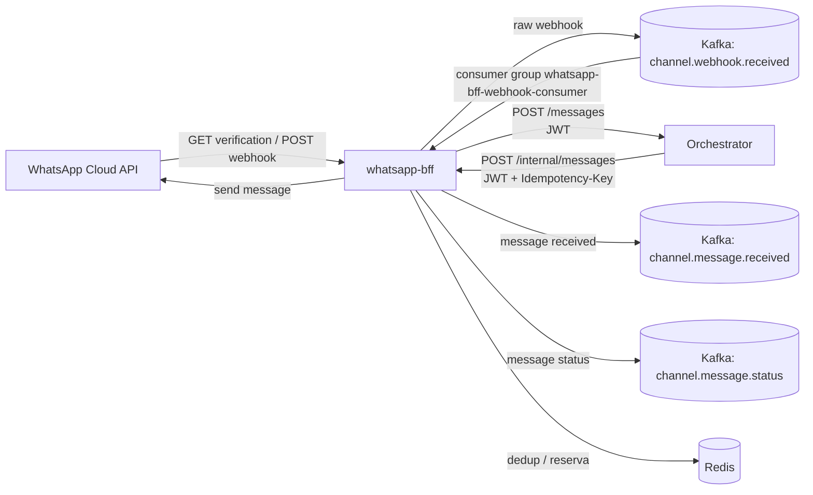

# WhatsApp BFF

BFF em .NET 8 para integração com WhatsApp Cloud API.

O serviço recebe webhooks do WhatsApp, valida assinatura, persiste a entrega bruta em Kafka, consome essa fila de forma durável, encaminha mensagens recebidas para um Orchestrator e publica eventos canônicos de canal. Também expõe um endpoint interno para envio de mensagens outbound via WhatsApp Cloud API.

## Responsabilidades

- Verificar o webhook configurado no WhatsApp Cloud API.
- Receber webhooks de mensagens e status do WhatsApp.
- Validar assinatura `X-Hub-Signature-256` usando `WhatsApp:AppSecret`.
- Aplicar deduplicação em memória para entregas repetidas de mensagens.
- Persistir o payload bruto do webhook no tópico Kafka `channel.webhook.received` antes de processar.
- Consumir o webhook bruto do Kafka e transformar em eventos de domínio, com retry/dead-letter por número de tentativas.
- Encaminhar mensagens inbound para o Orchestrator, assinando um JWT interno por chamada.
- Publicar eventos `channel.message.received` e `channel.message.status` no Kafka.
- Enviar mensagens outbound pela WhatsApp Cloud API, com reserva de idempotência no Redis para evitar envio duplicado.

## Arquitetura



Para o passo a passo detalhado dessa jornada — incluindo o que acontece do lado do Orchestrator, do agente de IA e do Core Bancário — ver [Diagramas de sequência da jornada](https://github.com/leandrosflora/conversational-ai-demo-arch/blob/main/docs/architecture/sequence-diagrams.md) em `conversational-ai-demo-arch`.

## Stack

- .NET 8 / ASP.NET Core Minimal APIs
- Confluent.Kafka
- StackExchange.Redis (idempotência do envio outbound)
- JWT interno (HS256) para chamadas de/para o Orchestrator
- Swagger / OpenAPI em ambiente `Development`
- HttpClient com resilience handler para chamada ao Orchestrator
- MemoryCache para deduplicação simples de mensagens inbound

## Endpoints

### `GET /webhooks/whatsapp`

Endpoint de verificação do webhook pelo WhatsApp.

Query params esperados:

| Parâmetro | Descrição |
|---|---|
| `hub.mode` | Deve ser `subscribe` |
| `hub.verify_token` | Deve bater com `WhatsApp:VerifyToken` |
| `hub.challenge` | Valor retornado em texto puro quando a verificação é válida |

Respostas:

| Status | Condição |
|---|---|
| `200 OK` | Token válido; retorna o `hub.challenge` |
| `403 Forbidden` | Token inválido ou payload incompleto |

### `POST /webhooks/whatsapp`

Recebe entregas do WhatsApp Cloud API.

Headers relevantes:

| Header | Descrição |
|---|---|
| `X-Hub-Signature-256` | Assinatura HMAC SHA-256 validada com `WhatsApp:AppSecret` |

Comportamento:

1. Gera `CorrelationId` para rastreabilidade.
2. Valida assinatura do webhook.
3. Desserializa o payload do WhatsApp.
4. Ignora entregas duplicadas quando todos os `message.id` já foram processados.
5. Publica o JSON bruto em `Kafka:RawWebhookReceivedTopic`.
6. Retorna sucesso apenas depois de persistir o payload no Kafka.

Respostas:

| Status | Condição |
|---|---|
| `200 OK` | Webhook aceito ou duplicado descartado |
| `400 Bad Request` | Payload inválido |
| `401 Unauthorized` | Assinatura ausente ou inválida |
| `503 Service Unavailable` | Falha ao persistir o webhook bruto no Kafka |

### `POST /internal/messages`

Endpoint interno para envio de mensagem outbound pelo WhatsApp. Exige autenticação e uma chave de idempotência — não é um endpoint público.

Headers obrigatórios:

| Header | Descrição |
|---|---|
| `Authorization` | `Bearer <jwt-interno>`, emitido pelo chamador (ex.: Orchestrator) com `aud=whatsapp-bff` |
| `X-Tenant-Id` | UUID do tenant; precisa bater com a claim `tenant_id` assinada no JWT |
| `Idempotency-Key` | Chave estável por tentativa de envio; reservada no Redis antes de chamar a WhatsApp Cloud API |

Request:

```json
{
  "to": "5511999999999",
  "type": "text",
  "text": "Olá!"
}
```

Validações atuais:

- `to` é obrigatório.
- `text` é obrigatório.
- `type` existe no contrato, mas a implementação atual envia apenas texto.

Respostas:

| Status | Condição |
|---|---|
| `202 Accepted` | Mensagem enviada para a WhatsApp Cloud API; retorna `messageId` (`duplicate: true` se já havia sido concluída com essa `Idempotency-Key`) |
| `400 Bad Request` | `to`/`text` ausente, ou `Idempotency-Key` ausente |
| `401 Unauthorized` | JWT ausente, inválido ou expirado |
| `403 Forbidden` | `X-Tenant-Id` não é UUID ou não bate com a claim assinada |
| `409 Conflict` | Já existe um envio em andamento (ou de outcome ambíguo) para essa `Idempotency-Key`; **não é para ser retentado automaticamente** (`retryable: false`) — exige reconciliação manual |
| `502 Bad Gateway` | A WhatsApp Cloud API rejeitou o envio, ou o outcome ficou ambíguo (nesse caso a reserva no Redis é mantida de propósito, para não permitir reenvio automático) |

Resposta de sucesso:

```json
{
  "messageId": "wamid..."
}
```

### `GET /health/ready`

Verifica se a chave de assinatura JWT interna é válida (≥32 bytes), se `Orchestrator:TenantId` é um UUID válido, e a conectividade com Kafka e Redis. Retorna `200` (`{"status":"ready"}`) ou `503` (`{"status":"not_ready","failures":[...]}`).

## Fluxo inbound

1. WhatsApp chama `POST /webhooks/whatsapp`.
2. O BFF valida a assinatura `X-Hub-Signature-256`.
3. O BFF publica o payload bruto em `channel.webhook.received`.
4. `KafkaWebhookConsumerService` consome o tópico bruto (e o de retry).
5. O mapper converte o payload em:
   - mensagens inbound;
   - eventos de status.
6. Mensagens inbound são encaminhadas para o Orchestrator em `POST /messages`, com um JWT assinado por chamada.
7. Após sucesso no Orchestrator, o BFF publica `channel.message.received`.
8. Eventos de status são publicados em `channel.message.status`.
9. Se o processamento falhar de forma recuperável, a mensagem é republicada em `channel.webhook.received.retry` após um backoff; ao esgotar `Kafka:MaxDeliveryAttempts`, vai para `channel.webhook.received.dlq` em vez de ser retentada para sempre.

## Garantia de processamento

O webhook HTTP só retorna sucesso após publicar o payload bruto no Kafka. Se a publicação falhar, retorna `503`, permitindo retry pelo provedor.

O consumidor Kafka usa commit manual. O offset só é commitado quando o processamento foi concluído com sucesso ou quando a mensagem é considerada inválida/irrecuperável (vai direto para a dead-letter). Em falha temporária no Orchestrator, a mensagem é republicada no tópico de retry com backoff, até o limite de `Kafka:MaxDeliveryAttempts`.

## Configuração

Arquivo base: `appsettings.json`.

```json
{
  "WhatsApp": {
    "PhoneNumberId": "",
    "AccessToken": "",
    "AppSecret": "",
    "VerifyToken": "",
    "GraphApiBaseUrl": "https://graph.facebook.com/v20.0"
  },
  "Orchestrator": {
    "BaseUrl": "http://localhost:8000",
    "TenantId": "00000000-0000-0000-0000-000000000001"
  },
  "InternalAuth": {
    "Issuer": "conversational-ai-platform",
    "ServiceName": "whatsapp-bff",
    "SigningKey": "",
    "TokenTtlSeconds": 300
  },
  "Kafka": {
    "BootstrapServers": "localhost:9092",
    "MessageReceivedTopic": "channel.message.received",
    "MessageStatusTopic": "channel.message.status",
    "RawWebhookReceivedTopic": "channel.webhook.received",
    "RawWebhookRetryTopic": "channel.webhook.received.retry",
    "RawWebhookDeadLetterTopic": "channel.webhook.received.dlq",
    "WebhookConsumerGroupId": "whatsapp-bff-webhook-consumer",
    "MaxDeliveryAttempts": 5,
    "RetryBackoffSeconds": 2
  },
  "Otel": {
    "OtlpEndpoint": "http://localhost:4317"
  }
}
```

A connection string do Redis é lida da seção `Redis` (ver `RedisOptions`), com default `localhost:6379`.

### Variáveis sensíveis

Não versionar tokens, secrets ou a chave de assinatura JWT no `appsettings.json`.

Use variáveis de ambiente ou User Secrets:

```bash
dotnet user-secrets init
dotnet user-secrets set "WhatsApp:PhoneNumberId" "<phone-number-id>"
dotnet user-secrets set "WhatsApp:AccessToken" "<access-token>"
dotnet user-secrets set "WhatsApp:AppSecret" "<app-secret>"
dotnet user-secrets set "WhatsApp:VerifyToken" "<verify-token>"
dotnet user-secrets set "InternalAuth:SigningKey" "<segredo-com-pelo-menos-32-bytes>"
```

## Execução local

Pré-requisitos:

- .NET SDK 8+
- Kafka acessível em `localhost:9092` ou ajuste de `Kafka:BootstrapServers`
- Redis acessível em `localhost:6379` ou ajuste de `Redis:ConnectionString`
- Orchestrator acessível em `Orchestrator:BaseUrl`
- Credenciais válidas do WhatsApp Cloud API para envio outbound e validação de webhook
- `InternalAuth:SigningKey` com pelo menos 32 bytes, igual ao configurado nos serviços que chamam `/internal/messages`

Restaurar dependências:

```bash
dotnet restore
```

Executar:

```bash
dotnet run
```

Rodar os testes:

```bash
dotnet test
```

URLs locais configuradas em `launchSettings.json`:

- HTTP: `http://localhost:5153`
- HTTPS: `https://localhost:7171`
- Swagger em desenvolvimento: `/swagger`

## Tópicos Kafka

| Tópico | Direção | Uso |
|---|---|---|
| `channel.webhook.received` | Produz e consome | Fila durável de payload bruto do webhook |
| `channel.webhook.received.retry` | Produz e consome | Reentrega com backoff após falha recuperável |
| `channel.webhook.received.dlq` | Produz | Dead-letter após esgotar `Kafka:MaxDeliveryAttempts` |
| `channel.message.received` | Produz | Evento canônico de mensagem inbound recebida |
| `channel.message.status` | Produz | Evento canônico de status de mensagem |

## Contrato com Orchestrator

O BFF encaminha mensagens inbound para o Orchestrator via:

```http
POST /messages
Authorization: Bearer <jwt-interno>
```

Base URL configurada em:

```json
"Orchestrator": {
  "BaseUrl": "http://localhost:8000",
  "TenantId": "00000000-0000-0000-0000-000000000001"
}
```

A chamada usa `HttpClient` com retry configurado no ASP.NET resilience handler, e um JWT assinado por chamada com `InternalAuth:SigningKey`.

## Observabilidade

- Logs incluem `TraceId`, `SpanId` e `ParentId` via `ActivityTrackingOptions`.
- Cada webhook recebido recebe um `CorrelationId`.
- O `CorrelationId` é propagado no header da mensagem Kafka bruta.
- Logs de escopo são renderizados no console.

## Segurança

- `AccessToken`, `AppSecret`, `VerifyToken` e `InternalAuth:SigningKey` devem ser tratados como segredo.
- A validação do webhook depende de `X-Hub-Signature-256`.
- O endpoint `/internal/messages` exige JWT interno (`Authorization: Bearer`) com `X-Tenant-Id` batendo com a claim assinada, além de `Idempotency-Key`.

## Limitações atuais

- Deduplicação de webhook inbound é em memória; reinício da aplicação limpa esse estado (a idempotência do envio outbound, essa sim, é persistida no Redis).
- O contrato outbound contém `type`, mas o envio implementado é apenas texto.

## CI

`.github/workflows/ci.yml` roda `dotnet build`/`dotnet test` a cada push/PR para `master`, com um container Redis efêmero (necessário porque `/internal/messages` resolve uma conexão Redis real durante o binding da requisição).

## Comandos úteis

```bash
# Build
dotnet build

# Test
dotnet test

# Run
dotnet run

# Swagger local
open http://localhost:5153/swagger
```

## Estrutura principal

```text
.
├── Adapters
│   ├── Inbound
│   │   ├── Http
│   │   └── Messaging
│   └── Outbound
│       ├── Http
│       ├── Messaging
│       └── Persistence
├── Application
│   ├── Ports
│   └── UseCases
├── Configuration
├── Domain
├── Platform
├── Program.cs
├── appsettings.json
├── Dockerfile
├── whatsapp-bff.csproj
└── whatsapp-bff.Tests/
```
